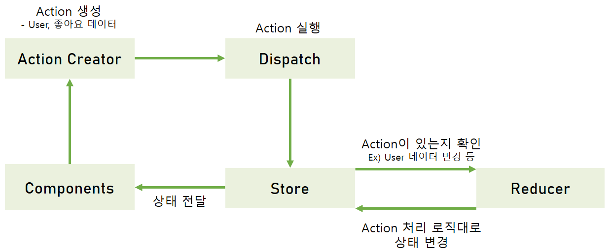

<div align="center">
  <br />
     

### 🎬[Demo 시연영상](https://youtu.be/-OebDDxU9fI)
💡삼성 청년 SW 아카데미💡     
📆2024.01.08 ~ 2024.02.16📆
<hr >

<h3>강의 정보, 리뷰, 커뮤니티를 한 곳에서 관리하며, 스터디 그룹을 구성하여 사용자의 학습 경험을 향상시키는 통합 플랫폼</h3>

</div>


## 목차
|<center>No</center>|<center>내용</center>|
|:----:|:----:|
|**1**|[**💡 프로젝트 개요**](#💡-프로젝트-개요)
|**2**|[**🗒 주요 기능**](#🗒-주요-기능)
|**3**|[**🔍 기술 스택**](#🔍-기술-스택)
|**4**|[**💾 DataBase**](#💾-DataBase)
|**5**|[**📂 시스템 아키텍처**](#📂-시스템-아키텍처) 
|**6**|[**📱 기술 소개**](#📱-기술-소개)
|**7**|[**👪 팀 소개**](#👪-팀-소개)
|**8**|[**🗂️ Directory 구조**](#🗂️-Directory-구조)


## 💡 프로젝트 개요
```
IT 교육시장 규모가 증가하고 기술 학습 트렌드가 오프라인에서 온라인으로 변화함에 따라, 온라인 강의의 수요가 높아졌습니다. 
그러나 너무 많은 IT 강의 플랫폼으로 인해 정보의 파편화가 발생하고,     
학습자들이 스터디 그룹을 구성하거나 학습 경험을 공유하는 공간이 부족하여 사용자들에게 불편함을 주고 있습니다.
이를 해결하고자 사용자들에게 편의성과 효율성을 제공하는 서비스를 개발하고자 이 프로젝트를 기획하게 되었습니다.
```

## 🗒 주요 기능
- **강의 검색 및 비교**: 다양한 강의 정보를 검색하고, 사용자가 원하는 기준에 따라 강의들을 비교할 수 있습니다.
- **강의 리뷰 및 평가**: 강의에 대한 사용자 리뷰를 작성하고, 평가할 수 있으며 다른 사용자의 리뷰를 보고 강의를 결정할 수 있습니다.
- **커뮤니티 서비스**: 학습 경험을 공유하고, 학습에 관련된 다양한 토론을 할 수 있는 커뮤니티를 제공합니다.
- **스터디 그룹 구성**: 같은 학습 목표를 가진 사용자들과 함께 스터디 그룹을 만들고, 공동 학습을 진행하는 기능을 제공합니다.

### 메인 화면


### 회원

**로그인**


**로그인시 추가정보 입력**


**마이페이지**


### 강의

**강의 목록**


**강의 비교**


**강의 상세정보**


**강의 리뷰**


### 커뮤니티

**커뮤니티**


**커뮤니티 글 작성**


### 스터디룸

**스터디룸 생성**


**스터디룸 멤버조회**


**스터디룸 초대코드 입장**


**스터디룸 채팅**


**스터디룸 알림**


## 🔍 기술 스택
### FrontEnd
     

   


### BackEnd
   

 


### DataBase

  

### Infra

      

### Collaboration Tool
     


## 💾 DataBase
### Maria DB ERD

#### 강의
 

#### 커뮤니티
 

#### 스터디룸
 

#### 회원
 

### Mongo DB 구조 - 채팅
 
 


## 📂 시스템 아키텍처
 


## 📱 기술 소개

### Redux 적용
> User 와 같은 데이터를 체계적으로 관리하기 위해, 중앙화된 데이터 처리를 통해 상태 관리를 할 수 있는 Redux를 도입했습니다.

**Redux**



- 컴포넌트 간 데이터 공유를 용이하게 하여, 애플리케이션의 상태를 효율적으로 관리하였습니다.
- 새로고침하면 데이터가 손실되는 이슈가 있어, Redux-persist를 도입하여 데이터를 관리하였습니다.
- 사용자가 입력한 정보, 설정, 애플리케이션 상태 등을 보존하여 사용자 경험을 향상시켰습니다.

### Stomp를 이용한 채팅 구현
> 스터디룸에서 1:1, 다:다 채팅을 구현하기 위해 Stomp 프로토콜과 MongoDB를 사용하여 소켓 통신을 구현하였습니다.

**Stomp**
- 텍스트 기반 메시지 프로토콜로, pub/sub구조로 되어있어 메시징 처리를 간편하게 할 수 있습니다.
- pub/sub 구조: 특정 주제에 대해 구독하면, 해당 주제에 대해 발행된 메시지를 구독자에게 전달이 가능하여 다대다 채팅에 용이합니다.
- WebSocket Secssion 처리를 따로 관리할 필요가 없습니다.

**Message Broker**
- Publisher로 부터 전달받은 메시지를 Subscriber에게 메시지를 주고 받게 하는 중간역할을 수행합니다.
- Spring Boot에서는 Spring Application이 Stomp 브로커가 됩니다.

**MongoDB**
- Document, BSON 데이터 형식으로 저장되어 적은 용량을 사용하고 처리속도가 빠릅니다. 
- 수평적으로 확장하는데 용이합니다.    
- 많은 양의 데이터를 Read/Write하기 용이하고, 더 많은 사용자와 데이터를 수용할 수 있습니다.


**채팅 로직**

 

1. 채팅방 생성 및 구독
- 개인채팅 : 상대방에게 채팅을 신청하면 채팅방(Topic)을 생성하고, 채팅방(Topic)을 구독(sub)합니다. 상대방이 채팅방에 입장해서 채팅방(Topic)을 구독(Sub)합니다.

  

- 단체채팅 : 스터디룸을 생성하면 자동으로 3개의 채팅방(Topic)이 생성되며, 각각의 채팅방에 입장하여 구독(sub)합니다.
2. 메시지를 송신(pub)하면, 서버(메시지 브로커)는 해당 메시지를 채팅방(Topic)에 대한 메시지 큐로 전달합니다. 메시지는 들어온 순서대로 저장됩니다.
3. 메시지 브로커는 메시지를 구독 중인 클라이언트에게 전달합니다.

### redis 적용
> 게시글을 읽는 요청이 들어올 때마다 mariaDB의 viewCount 칼럼을 +1로 업데이트하는 것은 비효율적이라 판단하여, 성능향상을 위해 redis를 활용한 캐싱을 적용하였습니다.

**redis**
- 메모리에 저장되기 때문에 대기시간을 낮추고, 처리량을 높일 수 있습니다.
- "Write-Back" 전략: 데이터를 캐시에 모아서 일정 주기 배치 작업을 통해 DB에 반영하기 때문에 쓰기 쿼리 비용과 부하를 줄일 수 있습니다.

**로직**
1. 게시글 읽기 요청이 들어오면, 조회수를 redis(Cache Store)에 저장합니다.
2. 1시간에 한 번씩 스케줄링을 통해 DB 업데이트를 진행하여, Maria DB에 반영합니다.


### 강의 조회 성능 최적화
**문제점**
- 약 7만개의 강의에 대해 필터링, 정렬, 페이징 등을 수행하는 데 많은 시간이 소요되었습니다.
  - 강의에 대한 검색, 필터링, 정렬, 페이징은 Querydsl을 통해 하나의 쿼리로 구성됩니다. 검색 기능은 lecture테이블의 name(강의명), instructor(강사명) 에 대해 contains(mariadb : %like%) 를 활용하였기 때문에 10초 이상의 시간이 소요되었습니다.
- lecture 테이블의 칼럼들 외에 별점 등 실시간 계산되어 서비스에 사용되는 값들이 다수 존재하엿습니다.


**해결방안**
1. 해당 값들이 정렬 및 페이징에 사용되었기 때문에 join의 편리성을 위해 redis가 아닌 별도의 요약 테이블(lecture_summary) 을 두고 1시간에 한번씩 스케쥴링을 통해 테이블을 갱신(delete/insert into select) 하였습니다.
2. lecture테이블의 review_count 칼럼을 1시간에 한번씩 스케쥴링을 통해 update하였습니다.
- lecture 테이블 외 계산이 필요한 컬럼들
  - combinedRating: 실제 강의 사이트와 우리 서비스의 리뷰 별점을 통합하며 서비스 상에 표시되는 별점입니다.

    |우리 서비스의 리뷰 별점 개수|우리서비스 별점 가중치| 외부 사이트 별점 가중치|
    |----|----|----|
    |10개 미만|0.2|0.8|
    |10개 이상|0.5|0.5|

  - combinedRatingCount: 실제 강의 사이트 리뷰 개수 + 우리 서비스의 리뷰 개수
  - lectureLikeCount: 우리 서비스의 사용자들이 해당 강의를 찜한 개수
  - weight: 추천순 정렬을 위해 계산되는 값입니다.    
  ```
    실제 강의 사이트 수강생 수 * 0.4 + combined_rating * 0.35 + lecture_like_count * 0.15 + combined_rating_count * 0.1
  ```

3. MariaDB에서는 match() against(.. in boolean mode) 조건을 통해 Full-Text Index 를 활용한 Full-Text Search 를 지원합니다. 하지만 JPA는 해당 메서드를 기본 지원하지 않았기 때문에 FunctionContributor 를 extends하고 match() against(.. in boolean mode)를 사용자 정의 함수로 생성하여 인덱스를 활용한 효율적인 검색이 가능했습니다.


**(7만건의 강의 대상) 기능별 API 전송 속도**

|description|속도(단위: ms)|
|----|:----:|
|별점순으로 강의 정렬 후 1페이지 쿼리|122|
|추천순으로 강의 정렬 후 1페이지 쿼리|133|
|가격순으로 강의 정렬 후 1페이지 쿼리|88|
|태그 포함 모든 필터링 요소 적용 후 1페이지 쿼리|1426|
|필터링 미 적용 후 검색어 기반 쿼리|1266|
|필터링 적용 후 검색어 기반 쿼리|1602|


## 👪 팀 소개
|||||||
|:----:|:----:|:----:|:----:|:----:|:----:|
|[정승환<br >(팀장)](https://github.com/seunghw2)|[김지현](https://github.com/KimJyun)|[하동준](https://github.com/djh0211)|[남수진](https://github.com/ss0510s)|[김예지](https://github.com/gimezi)|[정유경](https://github.com/YuKyung-Chung)|


|<center>이름</center>|<center>역할</center>|<center>개발 내용</center>|어려웠던 점과 배운 점|
|:----:|:----:|----|----|
|정승환|BackEnd|- DB 설계  <br >- 강의 사이트 데이터 수집(약 7만개) <br > &emsp; - 데이터 크롤링 <br > &emsp; - 데이터 가공 및 적재 <br > -프로젝트 초기 세팅 <br > - 'JPA', 'QueryDSL'을 사용해 API 개발 <br > &emsp; - community 도메인 개발 <br > &emsp; - 회원, 마이페이지 도메인 개발 <br > - Spring Security 적용 <br > - 'redis' 적용 ( Nginx, Spring ) <br > &emsp; - 조회수 최적화 성공 |- JPA에 처음 접하는 팀원들을 위해 직접 학습 자료를 만들고 발표를 진행했습니다. 또한 프로젝트 시작 전, 프로젝트 초기 세팅, 패키지 구조 설정, 게시판 도메인에 대한 코드를 먼저 완성시켜 개발 효율성을 높일 수 있었습니다.<br >- JAVA 스펙을 활용하여 코드 품질을 향상시키기 위해 노력했습니다. Builder 패턴, Stream, Record를 사용하여 가독성을 향상 시키고 성능을 향상시킬 수 있었습니다.<br >- 기존 비효율적이었다고 판단되는 조회 수 증가 작업을 Redis와 Write-Back 전략을 사용하여 최적화하였습니다.|
|김지현|Infra, BackEnd|- CICD 구축 <br > &emsp; - Jenkins 연결, 파이프라인 작성 <br > &emsp; - gitlab 연결 <br > - 도커 구축 <br > &emsp;  - SpringBoot, react, mongoDB, redis, mariaDB <br > &emsp; - Nginx 구축 <br > &emsp;  &emsp; - Https 적용 <br >&emsp;  &emsp;   -리버스 프록시 설정  ||
|하동준|BackEnd|- DB 설계 <br > - 강의 사이트 데이터 수집(약 7만개) <br > &emsp; - 데이터 크롤링 <br > &emsp; - 데이터 가공 및 적재 <br > - 'JPA', 'QueryDSL'을 사용해 API 개발<br > &emsp; - 강의 도메인 개발 <br > &emsp; - 리뷰 도메인 개발 <br > - 강의 리뷰에 대한 gpt 적용 <br > - 필터링, 정렬, 검색에 대한 최적화 진행 |- 대용량 데이터를 기반으로 다양한 기능의 API를 설계하며 목적에 따라 JPQL, Native Query, Query Methods, Querydsl 를 선택하여 성능을 최적화할 수 있었습니다.<br >- 어떤 방법으로 검색어를 통한 강의 검색을 구현할지 많은 고민을 했습니다. 사용자 정의 메서드를 통해 index를 활용한 full-text search를 구현하였고 성능 향상을 이뤄냈습니다.<br > - redis를 활용한 데이터 캐싱, jenkins를 활용한 빌드 자동화, 그리고 nginx 리버스 프록시 등에 대해 학습할 수 있었습니다.|
|남수진|BackEnd|- DB 설계 <br > - 'JPA', 'QueryDSL'을 사용해 API 개발 <br > &emsp; - 스터디룸 도메인 개발 <br > - Stomp를 이용한 실시간 채팅 구현 <br >  &emsp; - MongoDB 구축 <br >  &emsp; - Nginx 적용 <br> &emsp; - BackEnd: 1대1, 다대다 Stomp 통신 구현 <br > &emsp; - FrontEnd: sockjs, stomp 소켓 통신 구현, 채팅방 ui 구현 <br > - 채팅 알림 구현|<br > - JPA와 QueryDSL을 사용하면서 ORM 기술과 동적 쿼리 작성 능력을 향상시킬 수 있었습니다. 이를 통해 데이터베이스와의 상호 작용을 효율적으로 처리할 수 있었고, 성능 최적화에도 도움이 되었습니다. <br > - WebSocket과 MongoDB 등을 학습하면서 실시간 통신 설계를 할 때, DB와 Socket을 어떻게 설계하는 것이 효율적일 지 고민했습니다.<br >- WebSocket을 이용한 실시간 통신에서 발생할 수 있는 이슈들을 해결하기 위해, WebSocket과 Stomp 프로토콜에 대한 학습을 통해 실시간 통신에 대한 이해를 높였습니다. <br > - 실시간 채팅 시스템을 구현함으로써 pub/sub 구조를 활용한 이벤트 기반 아키텍처에 대한 이해를 향상시킬 수 있었습니다.|
|김예지|FrontEnd|- Figma를 이용해 프로토타입 구성 <br > - 화면 구현 <br > &emsp; - 전체 화면 구성(Nav, Footer, 메인페이지 등) 구현 <br > &emsp; - 마이페이지 구현 <br > &emsp; - 강의 페이지(목록, 상세페이지 ) 구현 <br > &emsp; - 리뷰 페이지 구현 <br > - 로그인/로그아웃 구현 <br > - 'Redux', 'React-Query'를 이용한 상태관리 &emsp;<br > - 권한 설정 <br > &emsp;- 로그인 유무에 따른 화면 권한 설정 <br >&emsp; - 사용자 권한에 따른 상호작용 설정 <br > - 유효성 검사 구현|- 강의 검색에서 검색 인수가 매우 많고, 검색 가능한 컴포넌트가 나뉘어져 있어서 중앙에서 검색 인수를 관리해줄 리덕스를 이용하고, 검색하는 axios요청은 기능 당 하나의 컴포넌트에서만 진행해서 중복 호출을 막았습니다.<br >- 소셜로그인을 이용하고 추가 정보를 위한 api가 나뉘어져 있어서 비동기적 처리에 어려움이 많았습니다.<br >- Redux를 이용했을 때, 새로고침하면 없어지는 것을 처리하기 위해서 redux-persist를 적용하였습니다 <br >- 여러가지 예외 처리와 유효성 검사를 하며 비동기적 프로그램의 흐름에 대해 이해할 수 있었습니다 <br >- 사용자가 한 번에 서비스를 이해하고 활용할 수 있도록 UI / UX적인 디자인을 생각해볼 수 있는 기회였습니다|
|정유경|FrontEnd| - Figma를 이용해 프로토타입 구성 <br > - 화면 구현 <br > &emsp;- 스터디룸(모집, 입장, 채널) 화면 구현 <br >&emsp; - 스터디룸, 채널 모달 창 구현 <br >&emsp; - 커뮤니티 구현 <br > - BackEnd와 Oauth 통신 연결 <br > - 권한 설정 <br > &emsp;- 로그인 유무에 따른 화면 권한 설정 <br >&emsp; - 사용자 권한에 따른 상호작용 설정 <br > - 유효성 검사 구현|<br > - 컴포넌트 성능 최적화: 기능 단위로 컴포넌트를 나누고 불필요한 리렌더링을 방지하기 위해 노력했습니다. useEffect와 같은 React 훅을 활용하여 비동기 작업을 수행하고 그 결과를 상태로 업데이트할 수 있었습니다. <br > - 비동기 처리와 데이터 효율성: async/await와 같은 비동기 방식을 활용하여 데이터 흐름을 파악하고 관리하는 것이 어려웠습니다.<br > - 상태 관리 라이브러리의 활용: Redux와 같은 상태 관리 라이브러리의 동작 방식을 공부하고 프로젝트에 적용함으로써, 상태 업데이트와 데이터 흐름을 명확하게 이해하는 데 도움이 되었습니다. 이를 통해 코드의 유지보수성을 향상시키고 개발 과정을 더욱 효율적으로 관리할 수 있었습니다. <br >- 서버 사이드 렌더링과 통신 구현: 백엔드와의 통신 및 OAuth와 같은 인증 시스템을 구현하는 과정에서 서버 사이드 렌더링된 통신을 경험함으로써, 프론트엔드와 백엔드 간의 협업과 데이터 흐름을 더 잘 이해할 수 있었습니다.|


## 🗂️ Directory 구조

### FrontEnd
```bash
-frontend
  └─src
      ├─assets
      │  ├─banner
      │  ├─Help
      │  ├─Lecture
      │  ├─Login
      │  ├─ProfileIamge
      │  └─sites
      ├─common
      ├─components
      │  ├─Community
      │  ├─Home
      │  ├─Lecture
      │  └─StudyRoom
      ├─fonts
      ├─pages
      │  ├─Community
      │  ├─Lecture
      │  ├─MyPage
      │  └─StudyRoom
      └─store

```

|directory|description|
|:---:|----|
|assets|정적 자원 저장 폴더|
|common|공통 js 폴더|
|components|page에 들어가는 component 폴더|
|pages|라우팅을 수행하는 폴더|


### BackEnd
```bash
-backend
  ├─gradle
  │  └─wrapper
  └─src
      ├─main
      │  └─java
      │      └─com
      │          └─f17coders
      │              └─classhub
      │                  ├─global
      │                  │  ├─api
      │                  │  │  └─response
      │                  │  ├─config
      │                  │  │  ├─hibernate
      │                  │  │  ├─jpa
      │                  │  │  ├─mongo
      │                  │  │  ├─queryDsl
      │                  │  │  ├─redis
      │                  │  │  ├─s3
      │                  │  │  ├─security
      │                  │  │  ├─socket
      │                  │  │  └─swagger
      │                  │  ├─exception
      │                  │  │  └─code
      │                  │  └─util
      │                  └─module
      │                      ├─domain
      │                      │  ├─alarm
      │                      │  │  ├─controller
      │                      │  │  ├─repository
      │                      │  │  └─service
      │                      │  ├─category
      │                      │  │  ├─controller
      │                      │  │  ├─dto
      │                      │  │  │  └─resource
      │                      │  │  ├─repository
      │                      │  │  └─service
      │                      │  ├─channel
      │                      │  │  ├─controller
      │                      │  │  ├─dto
      │                      │  │  │  ├─request
      │                      │  │  │  └─response
      │                      │  │  ├─repository
      │                      │  │  └─service
      │                      │  ├─comment
      │                      │  │  ├─controller
      │                      │  │  ├─dto
      │                      │  │  │  ├─request
      │                      │  │  │  └─response
      │                      │  │  ├─repository
      │                      │  │  └─service
      │                      │  ├─community
      │                      │  │  ├─controller
      │                      │  │  ├─dto
      │                      │  │  │  ├─request
      │                      │  │  │  └─response
      │                      │  │  ├─repository
      │                      │  │  └─service
      │                      │  ├─communityLike
      │                      │  │  └─repository
      │                      │  ├─communityScrap
      │                      │  │  └─repository
      │                      │  ├─communityTag
      │                      │  │  └─repository
      │                      │  ├─job
      │                      │  │  ├─controller
      │                      │  │  ├─dto
      │                      │  │  │  └─response
      │                      │  │  ├─repository
      │                      │  │  └─service
      │                      │  ├─lecture
      │                      │  │  ├─controller
      │                      │  │  ├─dto
      │                      │  │  │  └─response
      │                      │  │  ├─repository
      │                      │  │  └─service
      │                      │  ├─lectureBuy
      │                      │  │  ├─repository
      │                      │  │  └─service
      │                      │  ├─lectureLike
      │                      │  │  ├─repository
      │                      │  │  └─service
      │                      │  ├─lectureSummary
      │                      │  │  ├─repository
      │                      │  │  └─service
      │                      │  ├─lectureTag
      │                      │  ├─member
      │                      │  │  ├─controller
      │                      │  │  ├─dto
      │                      │  │  │  ├─request
      │                      │  │  │  └─response
      │                      │  │  ├─repository
      │                      │  │  └─service
      │                      │  ├─memberTag
      │                      │  │  ├─repository
      │                      │  │  └─service
      │                      │  ├─message
      │                      │  │  ├─dto
      │                      │  │  │  └─request
      │                      │  │  ├─repository
      │                      │  │  └─service
      │                      │  ├─personalChat
      │                      │  │  ├─controller
      │                      │  │  ├─dto
      │                      │  │  │  ├─reponse
      │                      │  │  │  └─request
      │                      │  │  ├─repository
      │                      │  │  └─service
      │                      │  ├─review
      │                      │  │  ├─controller
      │                      │  │  ├─dto
      │                      │  │  │  ├─request
      │                      │  │  │  └─response
      │                      │  │  ├─repository
      │                      │  │  └─service
      │                      │  ├─study
      │                      │  │  ├─controller
      │                      │  │  ├─dto
      │                      │  │  │  ├─request
      │                      │  │  │  └─response
      │                      │  │  ├─repository
      │                      │  │  └─service
      │                      │  ├─studyMember
      │                      │  │  ├─repository
      │                      │  │  └─service
      │                      │  ├─studyTag
      │                      │  │  ├─repository
      │                      │  │  └─service
      │                      │  └─tag
      │                      │      ├─controller
      │                      │      ├─dto
      │                      │      │  └─response
      │                      │      ├─repository
      │                      │      └─service
      │                      └─security
      │                          ├─dto
      │                          ├─exception
      │                          ├─filter
      │                          └─handler
      └─test
          └─java
              └─com
                  └─f17coders
                      └─classhub

```

|directory|description|
|:---:|----|
|global/excetion|예외처리 관련 폴더|
|global/util|util 폴더|
|global/api|response 폴더|
|global/config|설정 관련 폴더|
|module/domain|도메인별 API 폴더|
|module/security|security 관련 폴더|

