<div align="center">
  <br />
     

### 🎬[Demo 시연영상](링크 삽입)
💡삼성 청년 SW 아카데미💡     
📆2024.01.08 ~ 2024.02.16📆
<hr >

<h3>강의 정보, 리뷰, 커뮤니티를 한 곳에서 관리하며, 스터디 그룹을 구성하여 사용자의 학습 경험을 향상시키는 통합 플랫폼</h3>

</div>


## 목차
|<center>No</center>|<center>내용</center>|
|:----:|:----:|
|**1**|[**프로젝트 개요**](#1)
|**2**|[**주요 기능**](#2)
|**3**|[**기술 스택**](#3)
|**4**|[**DataBase**](#4)
|**5**|[**시스템 아키텍처**](#5) 
|**6**|[**기술 소개**](#6)
|**7**|[**팀 소개**](#7)

<div id="1"></div>

## 💡 프로젝트 개요
```
IT 교육시장 규모가 증가하고 기술 학습 트렌드가 오프라인에서 온라인으로 변화함에 따라, 온라인 강의의 수요가 높아졌습니다. 
그러나 너무 많은 IT 강의 플랫폼으로 인해 정보의 파편화가 발생하고,     
학습자들이 스터디 그룹을 구성하거나 학습 경험을 공유하는 공간이 부족하여 사용자들에게 불편함을 주고 있습니다.
이를 해결하고자 사용자들에게 편의성과 효율성을 제공하는 서비스를 개발하고자 이 프로젝트를 기획하게 되었습니다.
```
<div id="2"></div>

## 🗒 주요 기능
- **강의 검색 및 비교**: 다양한 강의 정보를 검색하고, 사용자가 원하는 기준에 따라 강의들을 비교할 수 있습니다.
- **강의 리뷰 및 평가**: 강의에 대한 사용자 리뷰를 작성하고, 평가할 수 있으며 다른 사용자의 리뷰를 보고 강의를 결정할 수 있습니다.
- **커뮤니티 서비스**: 학습 경험을 공유하고, 학습에 관련된 다양한 토론을 할 수 있는 커뮤니티를 제공합니다.
- **스터디 그룹 구성**: 같은 학습 목표를 가진 사용자들과 함께 스터디 그룹을 만들고, 공동 학습을 진행하는 기능을 제공합니다.

<div id="3"></div>

## 🔍 기술 스택
### FrontEnd
     

   


### BackEnd
   

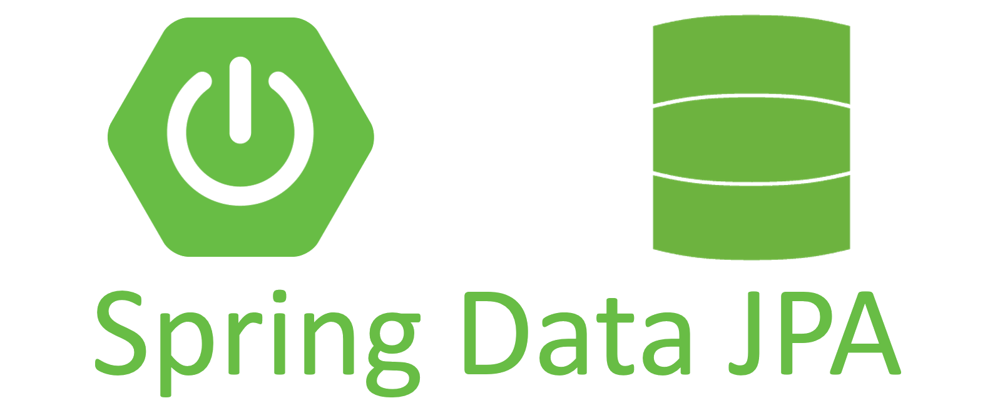 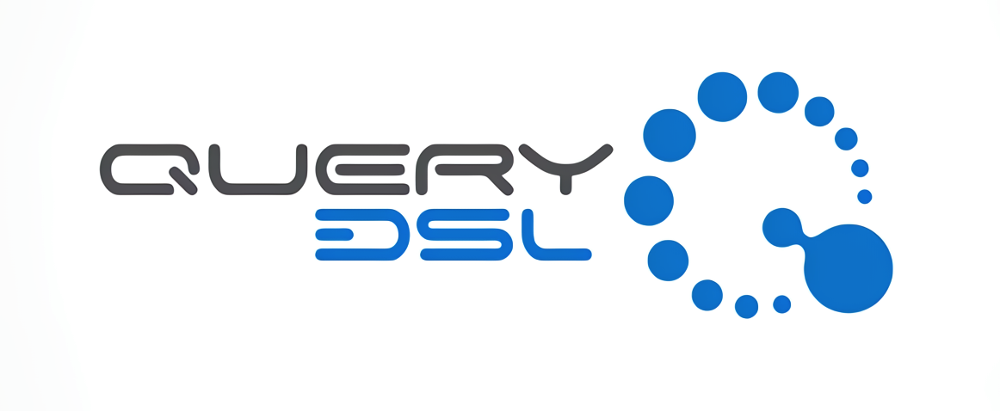


### DataBase

  

### Infra

      

### Collaboration Tool
     


<div id="4"></div>

## 💾 DataBase
### Maria DB ERD

#### 강의
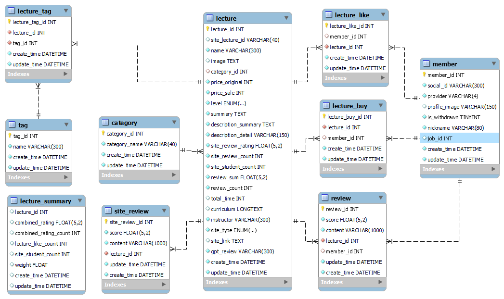 

#### 커뮤니티
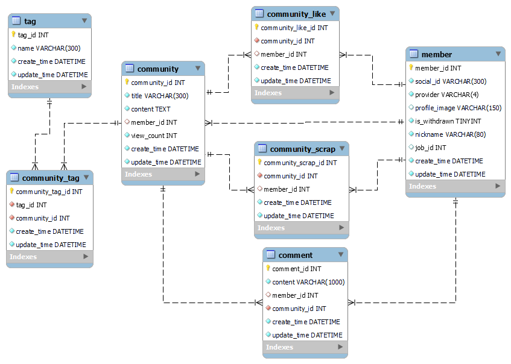 

#### 스터디룸
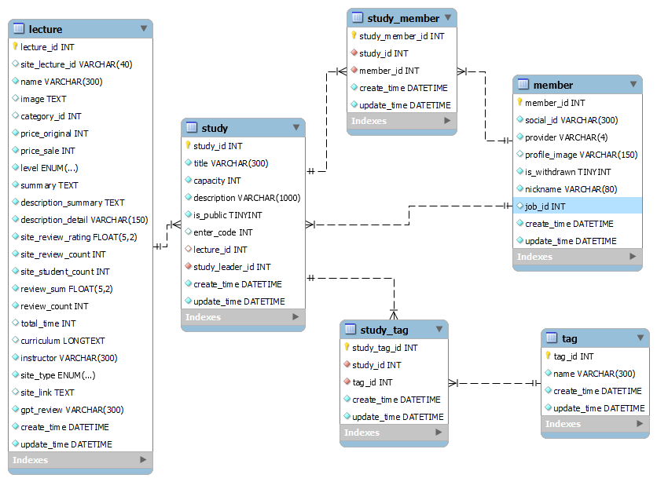 

#### 회원
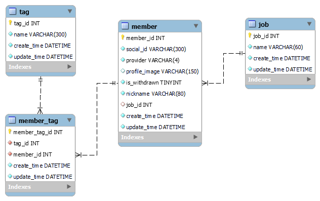 

### Mongo DB 구조 - 채팅
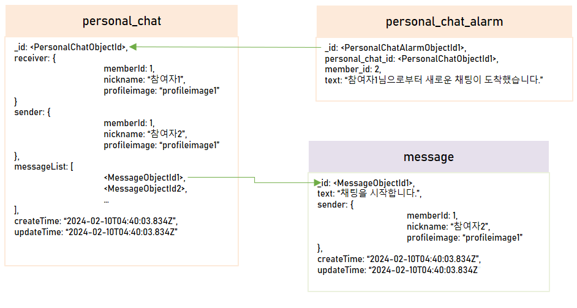 
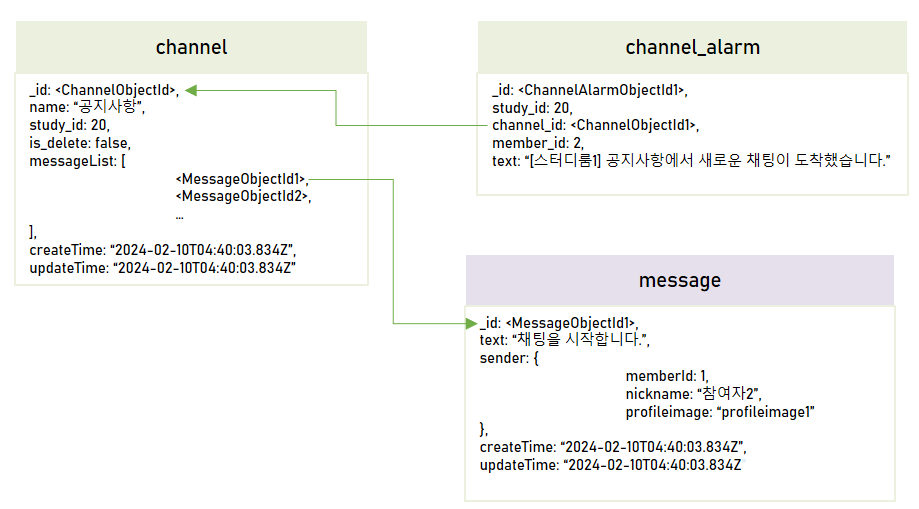 


<div id="5"></div>

## 📂 시스템 아키텍처
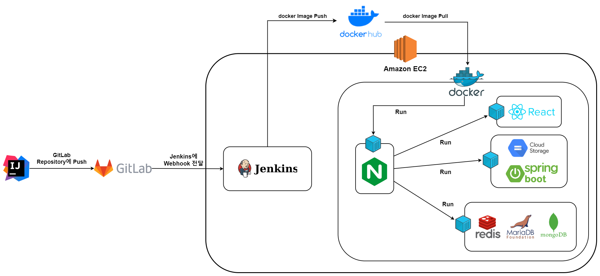 

<div id="6"></div>

## 📱 기술 소개

### Redux 적용
> ...

### Stomp를 이용한 채팅 구현
> 스터디룸에서 1:1, 다:다 채팅을 구현하기 위해 Stomp 프로토콜과 MongoDB를 사용하여 소켓 통신을 구현하였습니다.
**Stomp**
- 텍스트 기반 메시지 프로토콜로, pub/sub구조로 되어있어 메시징 처리를 간편하게 할 수 있습니다.
- pub/sub 구조: 특정 주제에 대해 구독하면, 해당 주제에 대해 발행된 메시지를 구독자에게 전달이 가능하여 다대다 채팅에 용이합니다.
- WebSocket Secssion 처리를 따로 관리할 필요가 없습니다.

**Message Broker**
- Publisher로 부터 전달받은 메시지를 Subscriber에게 메시지를 주고 받게 하는 중간역할을 수행합니다.
- Spring Boot에서는 Spring Application이 Stomp 브로커가 됩니다.

**MongoDB**
- Document, BSON 데이터 형식으로 저장되어 적은 용량을 사용하고 처리속도가 빠릅니다. 
- 수평적으로 확장하는데 용이합니다.    
- 많은 양의 데이터를 Read/Write하기 용이하고, 더 많은 사용자와 데이터를 수용할 수 있습니다.


**채팅 로직**

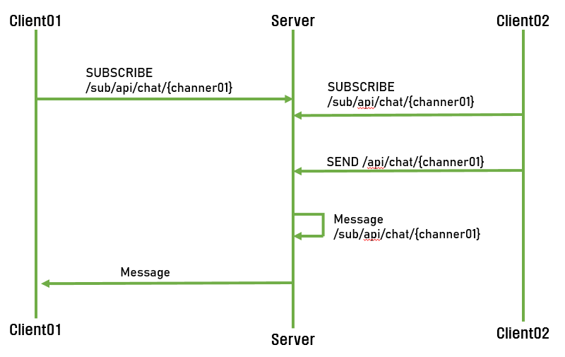 

1. 채팅방 생성 및 구독
- 개인채팅 : 상대방에게 채팅을 신청하면 채팅방(Topic)을 생성하고, 채팅방(Topic)을 구독(sub)합니다. 상대방이 채팅방에 입장해서 채팅방(Topic)을 구독(Sub)합니다.

  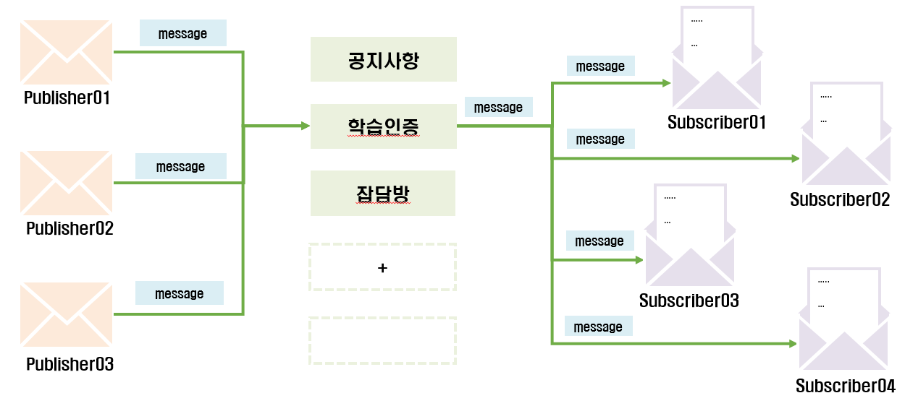

- 단체채팅 : 스터디룸을 생성하면 자동으로 3개의 채팅방(Topic)이 생성되며, 각각의 채팅방에 입장하여 구독(sub)합니다.
2. 메시지를 송신(pub)하면, 서버(메시지 브로커)는 해당 메시지를 채팅방(Topic)에 대한 메시지 큐로 전달합니다. 메시지는 들어온 순서대로 저장됩니다.
3. 메시지 브로커는 메시지를 구독 중인 클라이언트에게 전달합니다.

### redis 적용
...


### 강의 조회 성능 최적화
...

<div id="7"></div>

## 👪 팀 소개
|||||||
|:----:|:----:|:----:|:----:|:----:|:----:|
|[정승환<br >(팀장)](https://github.com/seunghw2)|[김지현](https://github.com/KimJyun)|[하동준](https://github.com/djh0211)|[남수진](https://github.com/ss0510s)|[김예지](https://github.com/gimezi)|[정유경](https://github.com/YuKyung-Chung)|


|<center>이름</center>|<center>역할</center>|<center>개발 내용</center>|
|:----:|:----:|----|
|정승환|BackEnd|- DB 설계  <br >- 강의 사이트 데이터 수집(약 7만개) <br > &emsp; - 데이터 크롤링 <br > &emsp; - 데이터 가공 및 적재 <br > -프로젝트 초기 세팅 <br > - 'JPA', 'QueryDSL'을 사용해 API 개발 <br > &emsp; - community 도메인 개발 <br > &emsp; - 회원, 마이페이지 도메인 개발 <br > - Spring Security 적용 <br > - 'redis' 적용 ( Nginx, Spring ) <br > &emsp; - 조회수 최적화 성공 |
|김지현|Infra, BackEnd|- CICD 구축 <br > &emsp; - Jenkins 연결, 파이프라인 작성 <br > &emsp; - gitlab 연결 <br > - 도커 구축 <br > &emsp;  - SpringBoot, react, mongoDB, redis, mariaDB <br > &emsp; - Nginx 구축 <br > &emsp;  &emsp; - Https 적용 <br >&emsp;  &emsp;   -리버스 프록시 설정  |
|하동준|BackEnd|- DB 설계 <br > - 강의 사이트 데이터 수집(약 7만개) <br > &emsp; - 데이터 크롤링 <br > &emsp; - 데이터 가공 및 적재 <br > - 'JPA', 'QueryDSL'을 사용해 API 개발<br > &emsp; - 강의 도메인 개발 <br > &emsp; - 강의 리뷰에 대한 gpt 적용 <br > - 필터링, 정렬, 검색에 대한 최적화 진행 |
|남수진|BackEnd|- DB 설계 <br > - 'JPA', 'QueryDSL'을 사용해 API 개발 <br > &emsp; - 스터디룸 도메인 개발 <br > - Stomp를 이용한 실시간 채팅 구현 <br >  &emsp; - MongoDB 구축 <br >  &emsp; - Nginx 적용 <br> &emsp; - BackEnd: 1대1, 다대다 Stomp 통신 구현 <br > &emsp; - FrontEnd: sockjs, stomp 소켓 통신 구현, 채팅방 ui 구현 <br > - 채팅 알림 구현|
|김예지|FrontEnd|- Figma를 이용해 프로토타입 구성 <br > - 화면 구현 <br > &emsp; - 전체 화면 구성(Nav, Footer, 메인페이지 등) 구현 <br > &emsp; - 마이페이지 구현 <br > &emsp; - 강의 페이지(목록, 상세페이지 ) 구현 <br > &emsp; - 리뷰 페이지 구현 <br > - 로그인/로그아웃 구현 <br > - 'Redux', 'React-Query'를 이용한 상태관리 &emsp;<br > - 권한 설정 <br > &emsp;- 로그인 유무에 따른 화면 권한 설정 <br >&emsp; - 사용자 권한에 따른 상호작용 설정 <br > - 유효성 검사 구현 |
|정유경|FrontEnd| - Figma를 이용해 프로토타입 구성 <br > - 화면 구현 <br > &emsp;- 스터디룸(모집, 입장, 채널) 화면 구현 <br >&emsp; - 스터디룸, 채널 모달 창 구현 <br >&emsp; - 커뮤니티 구현 <br > - BackEnd와 Oauth 통신 연결 <br > - 권한 설정 <br > &emsp;- 로그인 유무에 따른 화면 권한 설정 <br >&emsp; - 사용자 권한에 따른 상호작용 설정 <br > - 유효성 검사 구현|
