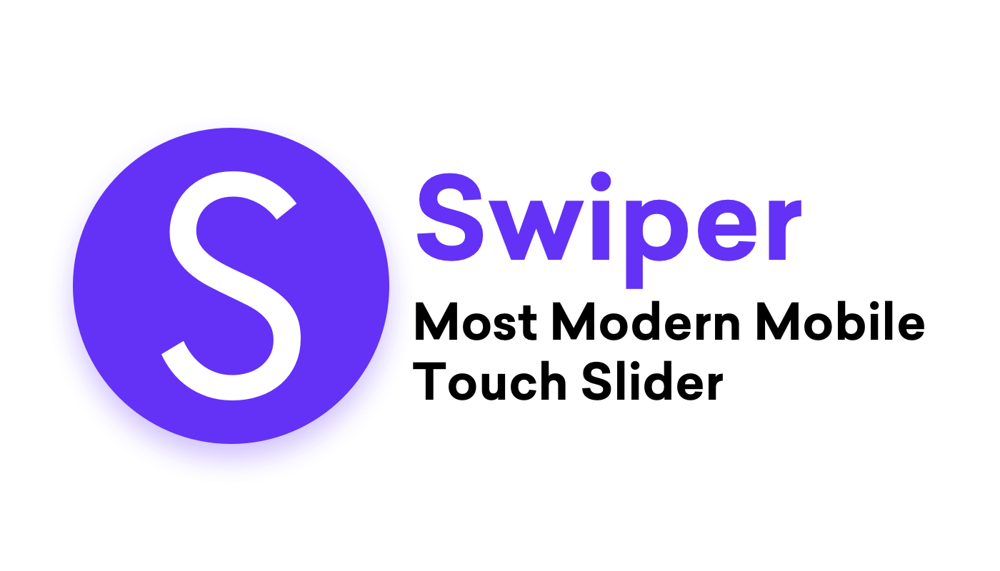

   
     
  <h1>ClassHub</h1>

### 🎬[Demo 시연영상](링크 삽입)

**강의 정보, 리뷰, 커뮤니티를 한 곳에서 관리하며, 스터디 그룹을 구성하여 사용자의 학습 경험을 향상시키는 통합 플랫폼**

## 목차
1. [**프로젝트 개요**](#1)
2. [**주요 기능**](#2)
3. [**기술 스택**](#3)
4. [**DataBase**](#4)
5. [**시스템 아키텍처**](#5) 
6. [**FrontEnd**](#6)
7. [**BackEnd**](#7)
8. [**팀 소개**](#8)

## 💡 프로젝트 개요
IT 교육시장 규모가 증가하고 기술 학습 트렌드가 오프라인에서 온라인으로 변화함에 따라, 온라인 강의의 수요가 높아졌습니다. 
 
그러나 너무 많은 IT 강의 플랫폼으로 인해 정보의 파편화가 발생하고, 
학습자들이 스터디 그룹을 구성하거나 학습 경험을 공유하는 공간이 부족하여 사용자들에게 불편함을 주고 있습니다.
 
이를 해결하고자 사용자들에게 편의성과 효율성을 제공하는 서비스를 개발하고자 이 프로젝트를 기획하게 되었습니다.

## 🗒 주요 기능
- **강의 검색 및 비교**: 다양한 강의 정보를 검색하고, 사용자가 원하는 기준에 따라 강의들을 비교할 수 있습니다.
- **강의 리뷰 및 평가**: 강의에 대한 사용자 리뷰를 작성하고, 평가할 수 있으며 다른 사용자의 리뷰를 보고 강의를 결정할 수 있습니다.
- **커뮤니티 서비스**: 학습 경험을 공유하고, 학습에 관련된 다양한 토론을 할 수 있는 커뮤니티를 제공합니다.
- **스터디 그룹 구성**: 같은 학습 목표를 가진 사용자들과 함께 스터디 그룹을 만들고, 공동 학습을 진행하는 기능을 제공합니다.

## 💡 기술 스택
### FrontEnd
    

 &emsp;  &emsp; 

### BackEnd
   

 &emsp;   &emsp;

### DataBase

  

### Infra
     

 

### Collaboration Tool
     

## 💾 DataBase
### Maria DB ERD
 
 
 
 

### Mongo DB 구조
 
 

## 📂 시스템 아키텍처
 

## 📱 Front-End

## 📲 Back-End

### 성능 최적화

### 

## 👪 팀 소개
|||||||
|----|----|----|----|----|----|
|[정승환 (팀장)](https://github.com/seunghw2)|[김지현](https://github.com/KimJyun)|[하동준](https://github.com/djh0211)|[남수진](https://github.com/ss0510s)|[김예지](https://github.com/gimezi)|[정유경](https://github.com/YuKyung-Chung)|

|이름|역할|개발 내용|
|----|----|----|
|정승환|BackEnd|- DB 설계   - 강의 사이트 데이터 수집(약 7만개)   &emsp; - 데이터 크롤링   &emsp; - 데이터 가공 및 적재   -프로젝트 초기 세팅   - community 도메인 개발   - 회원 도메인 개발   - Spring Security 적용   - redis 적용   &emsp; - 조회수 최적화 |
|김지현|Infra, BackEnd|- CICD 구축   &emsp; - Jenkins 연결, 파이프라인 작성   &emsp; - gitlab 연결   - 도커 구축   &emsp;  - SpringBoot, react, mongoDB, redis, mariaDB   &emsp; - Nginx 구축   &emsp;  &emsp; - Https 적용  &emsp;  &emsp;   -리버스 프록시 설정  |
|하동준|BackEnd|- DB 설계   - 강의 사이트 데이터 수집(약 7만개)   &emsp; - 데이터 크롤링   &emsp; - 데이터 가공 및 적재   - 강의 도메인 개발   - 강의 리뷰에 대한 gpt 적용   - 필터링, 정렬, 검색에 대한 최적화 진행 |
|남수진|BackEnd|- DB 설계   - 더미 데이터 생성   - 스터디룸 도메인 개발   - Stomp를 이용한 실시간 채팅 구현   &emsp; - BackEnd: 1대1, 다대다 Stomp 통신 구현   &emsp; - FrontEnd: sockjs, stomp 소켓 통신 구현, 채팅방 ui 구현   - 채팅 알림 구현|
|김예지|FrontEnd|- Figma를 이용해 프로토타입 구성   - 화면 구현   &emsp; - 전체 화면 구성(Nav, Footer, 메인페이지 등) 구현   &emsp; - 마이페이지 구현   &emsp; - 강의 페이지(목록, 상세페이지 ) 구현   &emsp; - 리뷰 페이지 구현   - 로그인/로그아웃 구현 &emsp;   - 로그인 유무에 따른 화면 권한 설정   - 유효성 검사 구현|
|정유경|FrontEnd| - Figma를 이용해 프로토타입 구성   - 화면 구현   &emsp;- 스터디룸(모집, 입장, 채널) 화면 구현  &emsp; - 스터디룸, 채널 모달 창 구현  &emsp; - 커뮤니티 구현   - BackEnd와 Oauth 통신 연결   - 권한 설정   &emsp;- 로그인 유무에 따른 화면 권한 설정  &emsp; - 사용자 권한에 따른 상호작용 설정   - 유효성 검사 구현|